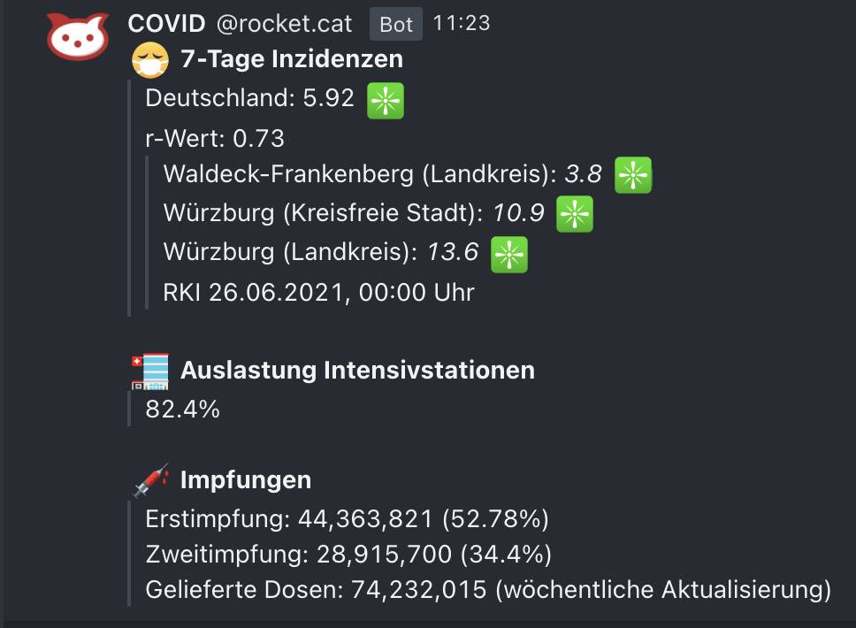

# covid19de_monitor

A simple python script to retrieve COVID19 data from the german RKI (Robert Koch-Institut).

## Motivation

The script collects 7-day-by-100K-people incidents for a pre-defined number of areas.
The data API of the RKI is used:
`https://npgeo-corona-npgeo-de.hub.arcgis.com/datasets/917fc37a709542548cc3be077a786c17_0`

## Usage

### Command Line

```
optional arguments:
  -h, --help            show this help message and exit
  -l, --list            Lists the available areas of interest as config JSON.
  -f FIND, --find FIND  Find & filters the available areas of interest
                        according to the given string (case sensitive!).
  -a AREAS, --areas AREAS
                        Receives JSON file with defined areas of interest.
  -i INCIDENCE, --incidence INCIDENCE
                        Find all areas with names including the given string
                        and return the 100k-7 incidence.
```

#### Examples

Find all 100k-by-7-days incidences for areas including the String "Berlin":

`python COVIDUpdate.py -i Berlin`

Find all 100k-by-7-days incidences for areas defined in the JSON file `areas_example.json`:

`python COVIDUpdate.py -a areas_example.json`

Define or extend a JSON config file for areas, by finding area definitions,
e.g. find all areas including the String "Berlin":

`python COVIDUpdate.py -f Berlin`

### API

You may call the script within your own code.
The following snippet retrieves the data for the area of interest "Würzburg city".

```
areas = [{'GEN': 'Würzburg', 'BEZ': 'Kreisfreie Stadt'}]
cu = COVIDUpdate()
result = cu.check(areas)
print(result)
```

See the included Slack bots for another example of API use.

## Compatibilty

The script is used with Python 3.8

# IntensivRegisterUpdate

Provides information about the current utilization of intensive care beds in Germany.
Uses the API from [intensivregister.de](https://www.intensivregister.de/#/aktuelle-lage/laendertabelle) and fetches data from:
`https://www.intensivregister.de/api/public/reporting/laendertabelle`

## Usage

### Command Line

```
optional arguments:
  -h, --help            show this help message and exit
  -lb, --listbundeslander
                        Lists all available states and their abbreviations
  -lk LANDKREIS, --landkreis LANDKREIS
                        Print Landkreis occupancy rate
  -s STADT, --stadt STADT
                        Print Stadt occupancy rate
  -b BUNDESLAND, --bundesland BUNDESLAND
                        Show the percentage of occupied beds in a specific state. Example: -b BY
  -d, --deutschland     Show the Percentage of all occupied beds in Germany
  -dn, --deutschlandwithemergency
                        Show the Percentage of all occupied beds in Germany including the 7 day
                        emergency beds
  -bn BUNDESLANDWITHEMERGENCY, --bundeslandwithemergency BUNDESLANDWITHEMERGENCY
                        Show the percentage of occupied beds in a specific state including the 7 day
                        emergency beds. Example: -bn BY
  -p PREFIX, --prefix PREFIX
                        Print given prefix as String before the actual number. Example: -p 'BY beds'
                        -bn BY
  -la, --listareas      Prints all names of the Landreise and Städte
  -a AREAS, --areas AREAS
                        Receives JSON file with defined areas of interest.
```

### Examples

Utilization of intensive care beds in germany in percent

`./IntensivregisterUpdate.py -a`

Utilization of intensive care beds in bavaria in percent

`./IntensivregisterUpdate.py -b BY`

Utilization of intensive care beds in bavaria in percent (including emergency
beds which could be provided within 7 days)

`./IntensivregisterUpdate.py -p 'Beds in BY: ' -bn BY`

Utilization of intensive care in a specific area

Landkreis

`./IntensivregisterUpdate.py -lk Würzburg`

Stadt

`./IntensivregisterUpdate.py -s Würzburg`

Utilization of intensive care in a specific area from json file

`./IntensivregisterUpdate.py -a areas_example.json`

# ImpfungUpdate

Provides information about the vaccination status in germany. Uses API from `https://api.corona-zahlen.org/docs/` to fetch data. Information about shipped vaccines in provided by [Impfdashboard.de](https://impfdashboard.de/daten).

## Usage

### Command Line

If no Bundesland is given as argument it will print information about Germany

````
usage: ImpfungUpdate.py [-h] [-bl BUNDESLAND] [-a] [-la] [-p PREFIX] [-d] [-df] [-ds] [-q] [-vf] [-vs] [-vb VACCINEBRAND] [-lvb] [-sv] [-sq] [-ls] [-sb SHIPPEDVACCINEBRAND] [-sbq SHIPPEDVACCINEBRANDQUOTE]

optional arguments:
  -h, --help            show this help message and exit
  -bl BUNDESLAND, --bundesland BUNDESLAND
                        Information about a Bundesland in germany
  -a, --all             All accinaations in a specific area
  -la, --listareas      Lists all available areas
  -p PREFIX, --prefix PREFIX
                        Print given prefix as string before the actual number. Example: -p 'Bayern Vaccinations' -bl Bayern -a
  -d, --difference      Difference in vaccinations to the day before for all vaccination
  -df, --differencefirst
                        Difference in vaccinations to the day before for the first vaccination
  -ds, --differencesecond
                        Difference in vaccinations to the day before for the second vaccination
  -q, --quote           Vaccinations quote
  -vf, --vaccinationfirst
                        Number of people who recived their first vaccination
  -vs, --vaccinationsecond
                        Number of people who recived their second vaccination
  -vb VACCINEBRAND, --vaccinebrand VACCINEBRAND
                        Number of vaccinations for a specified vaccine
  -lvb, --listvaccinebrand
                        Lists all available vaccine brands and the amount of times they were being used
  -sv, --shippedvaccines
                        All shipped vaccines
  -sq, --shippedvaccinatedquote
                        Quote of administered vaccinations / delivered vaccines in percent
  -ls, --listshippedvaccines
                        Lists all shipped vaccines
  -sb SHIPPEDVACCINEBRAND, --shippedvaccinebrand SHIPPEDVACCINEBRAND
                        Get all shipped vaccines by brand
  -sbq SHIPPEDVACCINEBRANDQUOTE, --shippedvaccinebrandquote SHIPPEDVACCINEBRANDQUOTE
                        Get shipped vaccines vaccination quote by brand```

### Examples

Get all registred vaccinations in germany
`./ImpfungUpdate.py -p "Alle durchgeführten Impfungen in Deutschland: " -a`

Get difference to the day before in Bavaria
`./ImpfungUpdate.py -p "Vergleich zum Vortag Bayern: " -bl Bayern -d`

Get vaccination per 1000 citizens in Bavaria
`./ImpfungUpdate.py -bl Bayern -t`

# Slack Bot (Using `slackclient`)

Let's you directly send the COVID19 data to a slack channel via a custom Slack APP.
Using [slacks python library](https://pypi.org/project/slackclient/).

## Requirements

### slackclient

`pip install slackclient`

### Building your own slack App

1.  Go to your slack workspace and select Manage Apps from Settings & administration

    

2.  Hit Build on the top right

    

3.  Next click on create App

    

4.  Name your App and select your preferred workspace

    

5.  Change the Permissions of your App

    

6.  Add OAuth Scopes to your App

    

7.  Add chat:write and chat:write.public

    

8.  Install the App to your workspace

    

9.  Copy your Bot token and insert it in SlackBot.py

    

10. Finally change the channel in SlackBot.py to your desired channel

# Slack Bot (using `bolt`)

Similar to the simple bot, this bot will keep running in the background and post updates at a given time every day.
You can configure the channel, trigger time and channel to send to via the `slack.config.json` file expected in `$PWD/config/`.

## Requirements

In addition to a `pip install slack_bolt`, follow the [Bolt Getting Started](https://api.slack.com/start/building/bolt-python)
guide to get a set of token and signing secret needed to connect the bot to Slack.

## Docker deployment

The included `Dockerfile` produces a container running the bot, exposing port 3000 for incoming messages.
Be sure to bind-mount the `slack.config.json` to `/app/config` or make it otherwise available.
````

# RocketChat Bot

Works like the Slack Bot (using`bolt`). A webhook needs to be specified in a rocketchat.config.json.

## Example output


