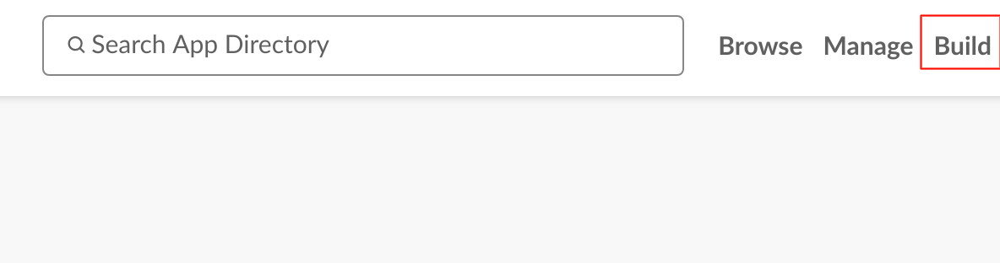
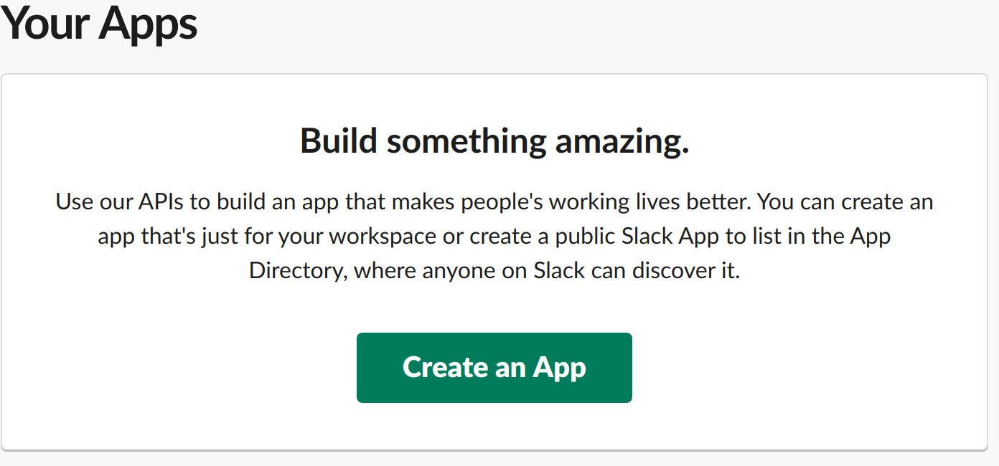
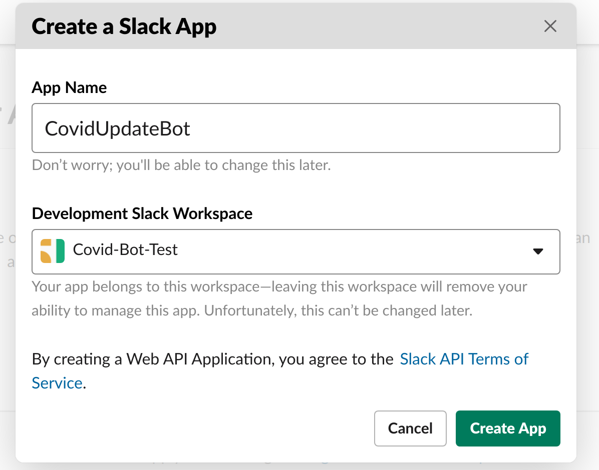
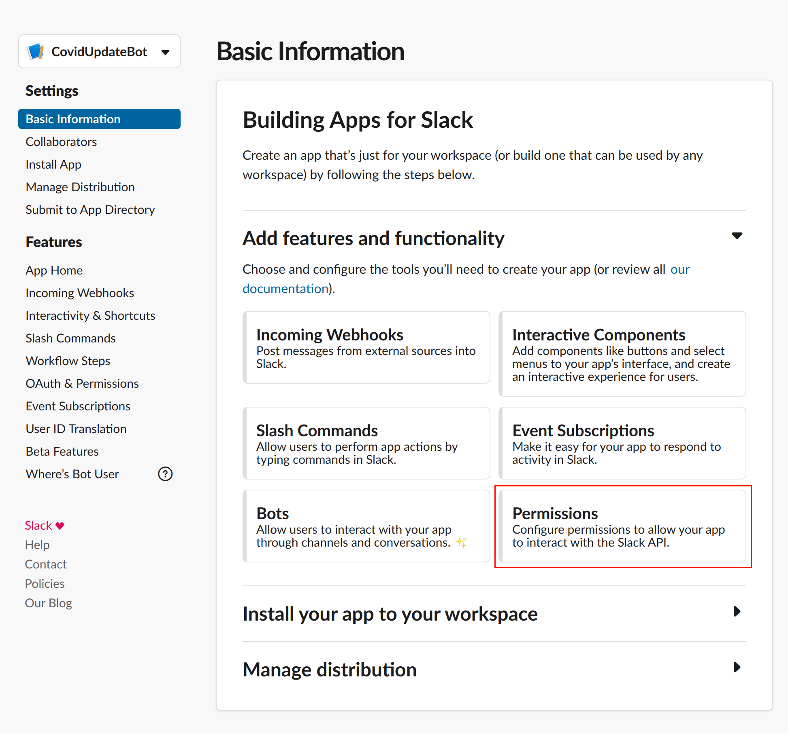
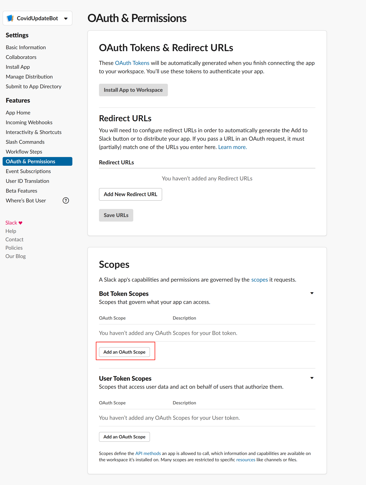
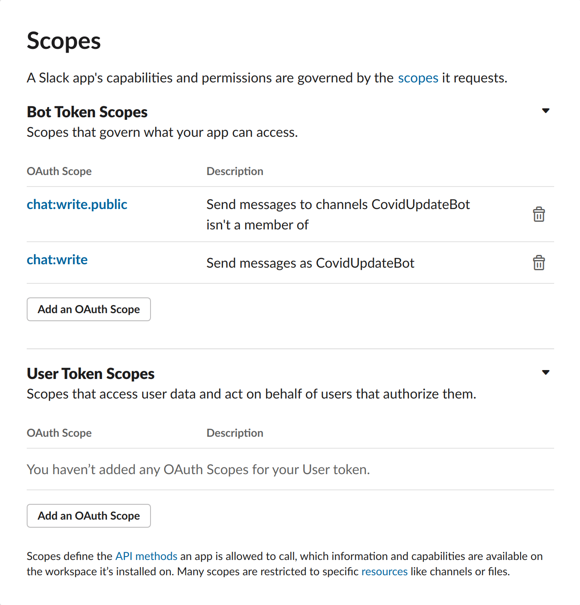
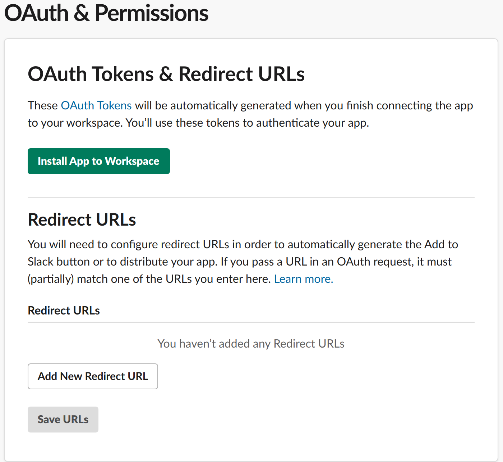
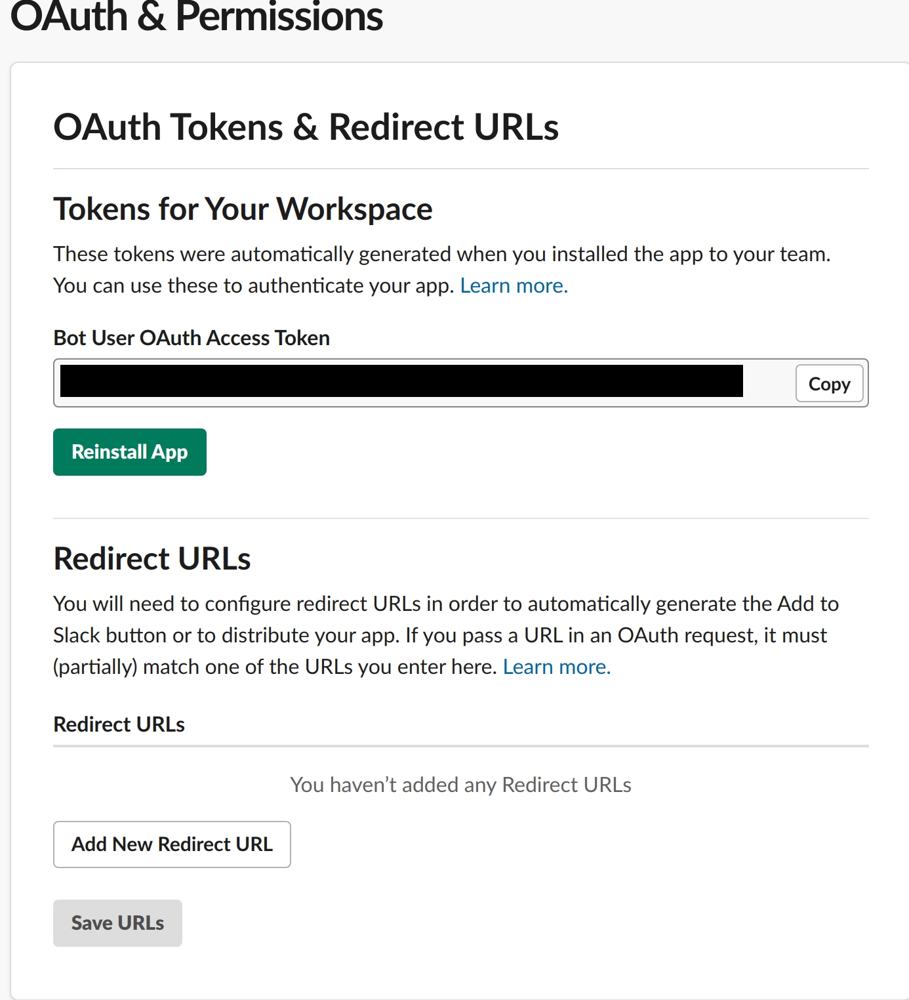

# covid19de_monitor

A simple python script to retrieve COVID19 data from the german RKI (Robert Koch-Institut).

## Motivation

The script collects 7-day-by-100K-people incidents for a pre-defined number of areas.
The data API of the RKI is used:
``https://npgeo-corona-npgeo-de.hub.arcgis.com/datasets/917fc37a709542548cc3be077a786c17_0``

## Usage

### Command Line

```
optional arguments:
  -h, --help            show this help message and exit
  -l, --list            Lists the available areas of interest as config JSON.
  -f FIND, --find FIND  Find & filters the available areas of interest
                        according to the given string (case sensitive!).
  -a AREAS, --areas AREAS
                        Receives JSON file with defined areas of interest.
  -i INCIDENCE, --incidence INCIDENCE
                        Find all areas with names including the given string
                        and return the 100k-7 incidence.
```

#### Examples

Find all 100k-by-7-days incidences for areas including the String "Berlin":

```python COVIDUpdate.py -i Berlin```

Find all 100k-by-7-days incidences for areas defined in the JSON file ``areas_example.json``:

```python COVIDUpdate.py -a areas_example.json```

Define or extend a JSON config file for areas, by finding area definitions, 
e.g. find all areas including the String "Berlin": 

```python COVIDUpdate.py -f Berlin``` 


### API

You may call the script within your own code.
The following snippet retrieves the data for the area of interest "Würzburg city".

```
areas = [{'GEN': 'Würzburg', 'BEZ': 'Kreisfreie Stadt'}]
cu = COVIDUpdate()
result = cu.check(areas)
print(result)
```

See the included Slack bots for another example of API use.

## Compatibilty

The script is used with Python 3.8

# Slack Bot (Using `slackclient`)

Let's you directly send the COVID19 data to a slack channel via a custom Slack APP.
Using [slacks python library](https://pypi.org/project/slackclient/).

## Requirements

### slackclient

`pip install slackclient`

### Building your own slack App

1.  Go to your slack workspace and select Manage Apps from Settings & administration

    

2.  Hit Build on the top right

    

3.  Next click on create App

    

4.  Name your App and select your preferred workspace

    

5.  Change the Permissions of your App

    

6.  Add OAuth Scopes to your App

    

7.  Add chat:write and chat:write.public

    

8.  Install the App to your workspace

    

9.  Copy your Bot token and insert it in SlackBot.py

     

10. Finally change the channel in SlackBot.py to your desired channel

# Slack Bot (using `bolt`)

Similar to the simple bot, this bot will keep running in the background and post updates at a given time every day.
You can configure the channel, trigger time and channel to send to via the `slack.config.json` file expected in `$PWD/config/`.

## Requirements

In addition to a `pip install slack_bolt`, follow the [Bolt Getting Started](https://api.slack.com/start/building/bolt-python)
guide to get a set of token and signing secret needed to connect the bot to Slack.

## Docker deployment

The included `Dockerfile` produces a container running the bot, exposing port 3000 for incoming messages.
Be sure to bind-mount the `slack.config.json` to `/app/config` or make it otherwise available. 

